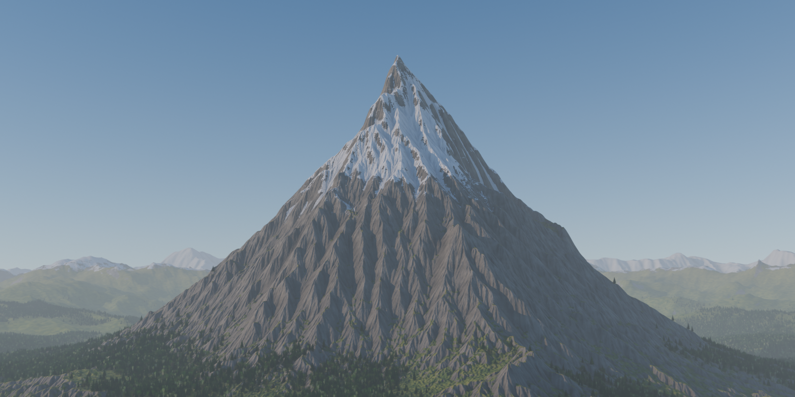
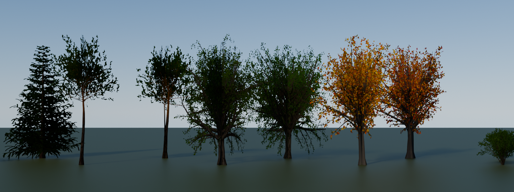
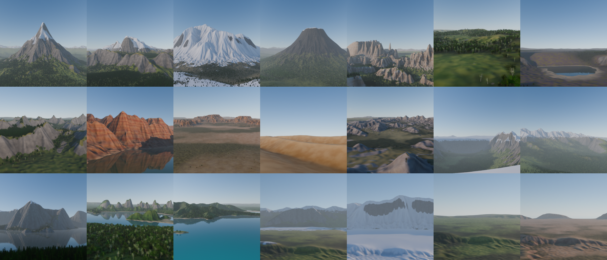

# Summit

**Free, open source procedural mountains for Blender.** A library of 17
eroded landforms (alpine peaks, ranges, volcanoes, canyons, mesas, dunes,
fjords and more), 14 biomes to dress them, light image-card forests, and
whole scenes around them: surroundings, distant mountains, aerial haze and a
camera that frames the shot for you.

- Scenes, not tiles: each terrain comes with surroundings out to twice its
  width and a matching ring of distant mountains, so you never see the edge
  of the world. *Frame Shot* finds a good camera view in about a second.
- Real erosion: every terrain is shaped by a droplet hydraulic simulation and
  thermal scree, so it has dendritic gullies, sharp ridges and sediment fans,
  not the blobby look of plain noise.
- Made for distance and close-ups. Baked normal and mask maps keep far
  mountains crisp on a light mesh. Up close, 3D procedural rock detail fades
  in: strata, fractures and grain, which never stretch on cliffs.
- Forests made from image cards of [Verdant](../verdant)'s procedural trees:
  12 triangles per tree, so whole mountainsides of trees stay fast. The cards
  carry albedo and leaf normals, not baked light, so they relight with your
  sun and sky.
- Scenes keep rendering without the add-on. The maps and tree images are
  packed into the .blend file.

## Features

- **17 landforms** in four categories:
  - **Mountains**: Alpine Peak, Mountain Range, Snowy Massif, Volcano,
    Dolomites.
  - **Hills**: Rolling Hills, Highlands, Wooded Foothills.
  - **Desert**: Canyon, Mesas & Buttes, Sand Dunes, Badlands.
  - **Landscapes**: Glacial Valley, Vast Landscape (12 km), Fjord, Karst
    Towers, Archipelago.
- **14 biomes**: Alpine, Arctic, Volcanic, Dolomite, Meadow, Highland, Forest,
  Autumn, Red Canyon, Desert, Sand Dunes, Badlands, Nordic and Tropical. Any
  landform can wear any biome.
- **Layered terrain shader**, one shared node group:
  - Rock with two colours, large-scale tone variation and water stains down
    cliffs and along erosion channels.
  - Horizontal strata, from subtle layering to banded canyon walls.
  - Scree and sediment where erosion dropped material.
  - Grass, moss or sand on gentle slopes, drying out on ridges and toward the
    ground line.
  - A forest-floor tint with sunlit crowns, so woods read as woods even from
    far away.
  - Snow by altitude and slope that gathers in gullies and couloirs, plus a
    fresh dusting on ledges below the snowline.
  - Boulders in the grass, a beach band at the waterline, and sand ripples
    for dunes.
  - Baked ambient occlusion, broad relief on big walls, and close-up detail
    that fades with camera distance.
- **Forests**: up to two layers per biome (for example broadleaf low down,
  firs up to the tree line). Trees thin out and shrink toward the tree line,
  stay off steep rock and out of the water, and gather in natural groves.
  There are 17 tree images in 5 species: fir, pine, broadleaf (oak, maple,
  birch), autumn broadleaf and shrub.
- **Surroundings**: low hills, meadows and forest out to twice the terrain's
  width, joined to its mesh. A plateau carries on as a plateau.
- **Horizon ring**: a seamless band of distant mountains around the scene, in
  four styles: Alpine Peaks, Snowy Range, Rolling Hills and Desert Mesas.
  *Distant Mountains* adds one in the terrain's biome automatically.
- **Frame Shot**: an automatic, side-lit camera view from inside the
  landscape. Click again for another angle.
- **Haze**: aerial perspective for the whole scene, thicker in the valleys,
  shared by terrains, forests and water.
- **Water** for the landforms that need it (canyon river, fjord, islands,
  karst plains). The shore band follows the water plane when you move it.
- **Regenerate** with a new seed, size, height, erosion or quality. Your
  material tweaks and forest settings are kept.

## Quality

| Quality | Maps | Mesh | Typical time |
|---|---|---|---|
| Preview | 512 px | 128 × 128 | about 2 s |
| Medium | 1K | 256 × 256 | about 9 s |
| High | 2K | 512 × 512 | about 40 s |
| Ultra | 4K | 1024 × 1024 | a few minutes |

The mesh only carries the silhouette; the normal map carries the detail.
Use Medium for backgrounds, High for most shots and Ultra for hero close-ups.

## Requirements

Blender 4.2 or newer (tested on 5.2 LTS). Cycles or EEVEE. Windows, macOS or Linux.

## Install

1. Download `summit-x.y.z.zip` from the [Releases](../../releases) page. Don't unzip it.
2. In Blender, go to *Edit → Preferences → Get Extensions*, open the **⌄** menu
   at the top right, choose **Install from Disk…**, and pick the zip.

## Use

Everything is in the 3D Viewport: **Sidebar (N) → Summit**.

- **Library**: pick a category and a landform, a biome (or *Preset Default*),
  a size, height, seed, erosion and quality, then click *Add Terrain*. It is
  placed at the 3D cursor. *Surroundings* and *Distant Mountains* are on by
  default; *Frame a Shot* also sets up the camera.
- **Horizon**: pick a style and biome, a distance, depth and height, then
  click *Add Horizon*. The ring is centred on the 3D cursor.
- **Terrain** (with a Summit terrain selected):
  - *Regenerate* changes the seed, size, height, erosion or quality. The dice
    button picks a new seed.
  - *Biome* re-dresses the terrain and swaps its forests.
  - *Frame Shot* aims the scene camera at a good view; click again for the
    next one. Adjust its camera height and focal length in the operator panel.
  - **Look**: snow line and amount, vegetation and tree lines, strata,
    cracks, colours, haze and close-up detail. Every other setting is on the
    *Summit Surface* node in the material.
  - **Forests**: one box per layer, with density, tree line, tree height,
    viewport amount and more. *Add Forest* adds a layer of any species.
  - **Water**: add or remove water, or move it with *Water Height*.
- **Haze**: density, how fast it thins with altitude, and colour, for every
  Summit object in the scene. Each terrain's *Haze* input scales its share.

### Tips

- Altitudes such as the snow line and tree line are fractions of the terrain
  height, so they stay right when you change the height.
- Forests show only part of their trees in the viewport (*Viewport Amount*).
  Renders always use them all.
- Adding a terrain raises the viewport and camera clip distance if needed.
  Adding forests raises Cycles' transparent bounces to 128, so dense forests
  don't render black.
- The terrain mesh has `sm_forest`, `sm_flow`, `sm_sediment` and `sm_apron`
  (0 on the terrain, 1 on its surroundings) attributes.
  Use them as masks in other scatter tools, such as Verdant's *Mask* field.
- For the most natural light, pair Summit with an
  [Open Sky](../open-sky) world.

## License

GPL-3.0-or-later. See [LICENSE](LICENSE). Everything Summit generates is yours
to use without restriction.
